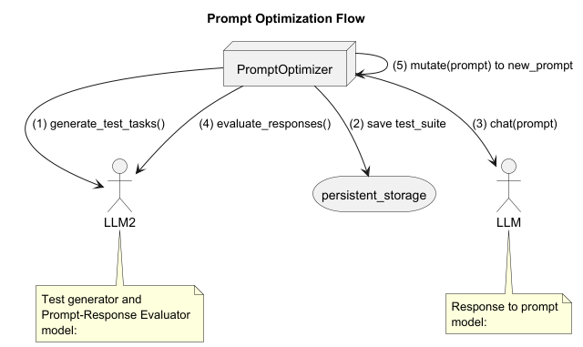

Introduction
------------

Collects prompt engineering practices with Claude LLM. 

 introduce API via examples.
- AntrophicPrompt: Accumulate messages and provides an abstraction for a conversation session. 
- How context influences generated completion
- How **system prompt** influences generated completion
- How **assistant prompt** influences generated completion
- How **temperature** (low,high) influences generated completion
- How generated completions consumed via **streaming** interface
- How **stop_sequences** stops generation in addition to **max_tokens**


Prompt Optimization
-------------------


One approach is to automate prompt refinement iterations programmatically.

 walks through an example. 
There are many moving parts in a prompt. 
A suitable framework needs to decompose all parts of prompt (system, assistant, output requirements, few samples, etc.)
so that a search algorithm could be developed. 

Utilized code in 
<a href="https://anthropic.skilljar.com/claude-with-the-anthropic-api/" target="_blank">Anthrophic Building with the Claude API</a> course [1]. 
Refactored the code by using role/task based class representation.

- **TestSuiteGenerator**: Generates test prompts with different inputs for the **same prompt** in DietitianForAthletes. 
  The purpose of these tests to make sure completions of **DietitianForAthletes** meets the expectations of LLM based service 
  because to be production quality, it needs to be robust to any user input. 
- **DietitianForAthletes**: represents a Dietitian specialized on preparing meal plan to meet nutritional needs of athletes.
  Its system prompt is configured accordingly and its temperature is set to 0.5.
- **PromptOutputGrader**: Execute test prompts, and grade completions. 
- **EvaluationWriter**: Writes the evaluation results into HTML file so that we can compare. 
- **AntrophicClient**: Encapsulates Anthrophic API client. Intent is able to test with different LLM (Claude, OpenAI, Gemini,...) and model combinations.
- **AntrophicPrompt**: This should accumulate messages and should be an abstraction for a prompt eventually with a better name. 

There is no concern with **separation of duties** because TestSuiteGenerator and 
PromptOutputGrader uses the same Claude model (claude-3-5-haiku-latest).

Another approach is to state prompt refinement as an optimization problem 
hence one can put **prompt refinement** in an optimization framework to search for an optimal prompt.
Evolutionary algorithm approach[2] is applicable for emulating iterative evolution of prompt population to find a set of high performing prompts. 
Clear definition of prompt representation will help to define mutation and cross-over operations. 
One approach is that we can utilize LLM to mutate a prompt or cross-over two prompts to obtain new offspring prompts. 
Then, EA applies selection to build the next generation of prompts. 

PromptOutputGrader should evolve as the quality of prompts increases. 
Graders should also incorporate context_window to reflect cost attribute of prompt. 
[Pareto front](https://web.stanford.edu/group/sisl/k12/optimization/MO-unit5-pdfs/5.8Pareto.pdf) will be a useful approach for comparison. 


Anatomy of a Prompt
----------
[14] summarized the components of a user prompt
1. Instruction (user prompt; what do we want LLM to generate)
1. User input (prompt_inputs dictionary in )
1. Context 
1. Sample (one/few samples of input-output pairs; 1,2,6)
1. Persona (system prompt)
1. Output specification

A hypothetical user prompt structure could be represented as

````
<persona>..</persona>. 
<instruction>..</instruction>. 
<output_specification>..</output_specification>

<user_input>
</user_input>

<guidelines>
</guideines>

<samples>
 <sample>
  <input>
  </input>
  <ideal_output>
  </ideal_output>
 </sample>

</samples>
````

An optimization algorithm will search a space defined by the following dimensions.
- model
- temperature
- persona
- instruction
- guidelines

because variations in output specification is low and task specific while user provides the user inputs to the prompt under test.

- mutation: rewrite the content in persona/instruction/guidelines with temperature (simulated annealing)
- crossover: apply crossover at sub-structure boundaries. 

Benchmarks
----------

Consider using the following benchmarks for evaluation.  
- [HotpotQA](https://hotpotqa.github.io/)(questions that require reasoning over multiple paragraphs), 
- [IFBench](https://github.com/allenai/IFBench) (following instructions), 
- [HoVer](https://hover-nlp.github.io/) (verifying facts), 
- [PUPA](https://github.com/Columbia-NLP-Lab/PAPILLON) (which gauges balance between helpfulness and unwanted sharing of personal information)


References
----------
1. [Anthrophic Building with the Claude API course](https://anthropic.skilljar.com/claude-with-the-anthropic-api/)
1. [An LLM-Based Genetic Algorithm for Prompt Engineering](https://dl.acm.org/doi/10.1145/3712255.3726633)
1. [EvoPrompt - A Game Changer for Optimizing AI Interactions](https://news.promptengineering.org/evoprompt-a-game-changer-for-optimizing-ai-interactions.html)
1. [Evolving Prompts with Genetic Algorithms: A Novel Approach to Prompt Engineering](https://medium.com/@eugenesh4work/evolving-prompts-with-genetic-algorithms-a-novel-approach-to-prompt-engineering-a2e1e0f53b9a)
1. [Connecting Large Language Models with Evolutionary Algorithms Yields Powerful Prompt Optimizers](https://openreview.net/pdf?id=ZG3RaNIsO8)
1. [EvoPrompt – Evolutionary Algorithms Meets Prompt Engineering. A Powerful Duo](https://ai.gopubby.com/evoprompt-evolutionary-algorithms-meets-prompt-engineering-a-powerful-duo-c30c427e88cc)
1. [EvoPrompt Implementation](https://github.com/beeevita/EvoPrompt)
1. [GAAPO: Genetic Algorithmic Applied to Prompt Optimization](https://arxiv.org/abs/2504.07157)
1. [DSPy](https://arxiv.org/abs/2310.03714) 
1. [DSPy Implementation](https://github.com/stanfordnlp/dspy)
1. [GAAPO: Genetic Algorithmic Applied to Prompt Optimization](https://arxiv.org/abs/2504.07157) HOPR (Hint Optimization and Prompt Refinement)
1. [GEPA: Reflective Prompt Evolution Can Outperform Reinforcement Learning](https://arxiv.org/abs/2507.19457)
1. [Building the Entire RAG Ecosystem and Optimizing Every Component](https://levelup.gitconnected.com/building-the-entire-rag-ecosystem-and-optimizing-every-component-8f23349b96a4)
1. [Understanding the Anatomies of LLM Prompts](https://www.codesmith.io/blog/mastering-llm-prompts)
1. [Anthropic's Prompt Engineering Interactive Tutorial](https://github.com/anthropics/prompt-eng-interactive-tutorial)
1. [Anthropic's Complex Prompts from Scratch](https://github.com/anthropics/prompt-eng-interactive-tutorial/blob/master/Anthropic%201P/09_Complex_Prompts_from_Scratch.ipynb)
1. [Prompt Engineering Overview](https://docs.claude.com/en/docs/build-with-claude/prompt-engineering/overview)
1. [Prompt Engineering](https://github.com/anthropics/courses/blob/master/real_world_prompting/03_prompt_engineering.ipynb)
1. [DSPy: Build and Optimize Agentic Apps](https://learn.deeplearning.ai/courses/dspy-build-optimize-agentic-apps/lesson/nj890/introduction)
1. [Optimizing Instructions and Demonstrations for Multi-Stage Language Model Programs](https://arxiv.org/abs/2406.11695)
1. [GEPA: Reflective Prompt Evolution Can Outperform Reinforcement Learning](https://arxiv.org/abs/2507.19457)
1. [HotpotQA: A Dataset for Diverse, Explainable Multi-hop Question Answering](https://arxiv.org/abs/1809.09600)
1. [Generalizing Verifiable Instruction Following](https://arxiv.org/abs/2507.02833)
1. [HoVer: A Dataset for Many-Hop Fact Extraction And Claim Verification](https://arxiv.org/abs/2011.03088)
1. [PAPILLON: Privacy Preservation from Internet-based and Local Language Model Ensembles](https://arxiv.org/abs/2410.17127)
1. [PUPA-PAPILLION Tutorial](https://colab.research.google.com/github/Columbia-NLP-Lab/PAPILLON/blob/main/papillon_tutorial.ipynb)
1. [Prompt Optimization](https://orq.ai/blog/prompt-optimization)
1. [A Survey of Automatic Prompt Optimization with Instruction-focused Heuristic-based Search Algorithm](https://arxiv.org/pdf/2502.18746)
1. [Exploring Prompt Optimization](https://blog.langchain.com/exploring-prompt-optimization/)